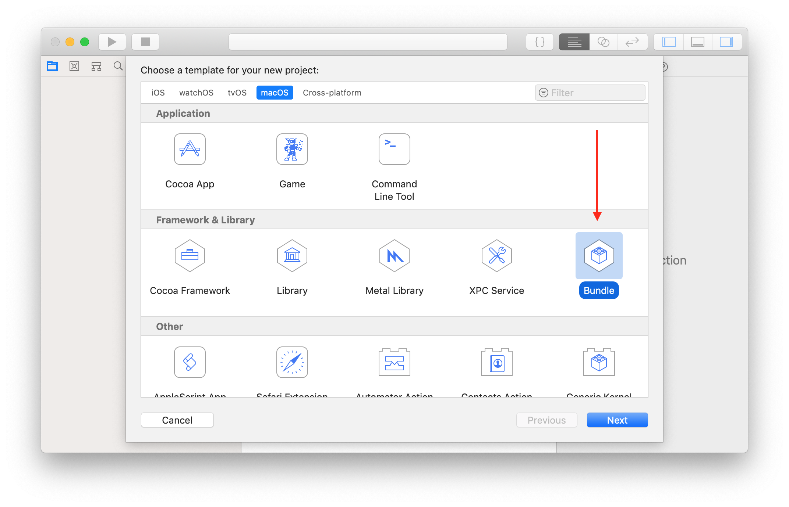
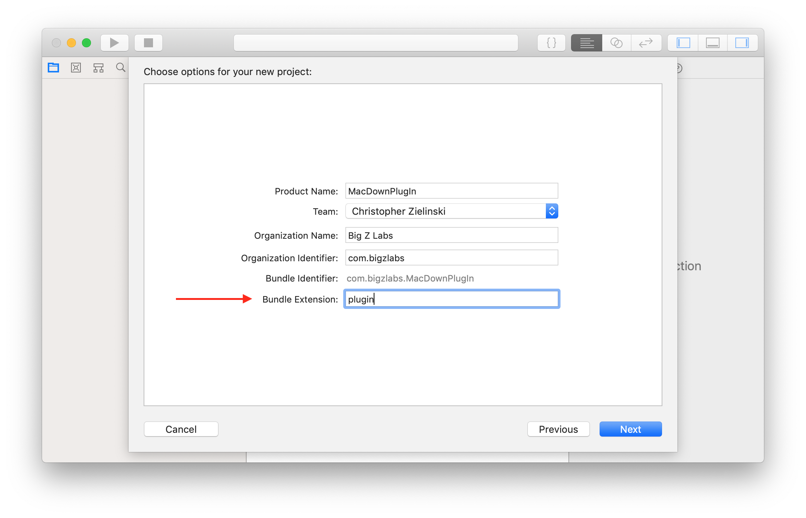
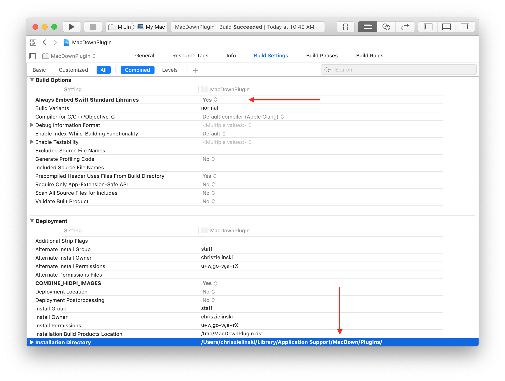
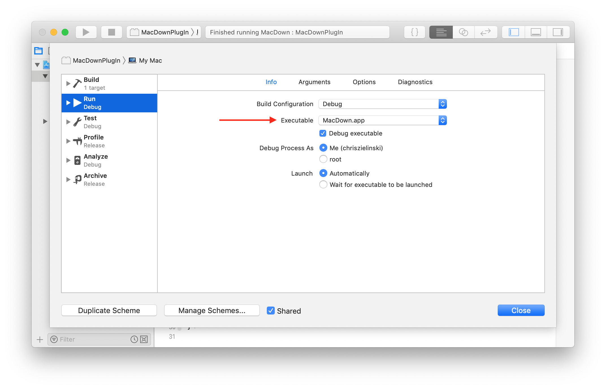
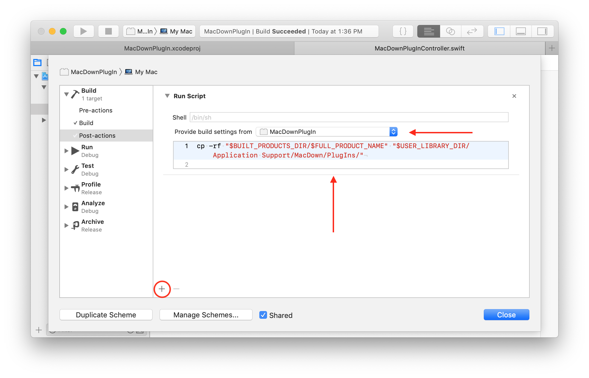
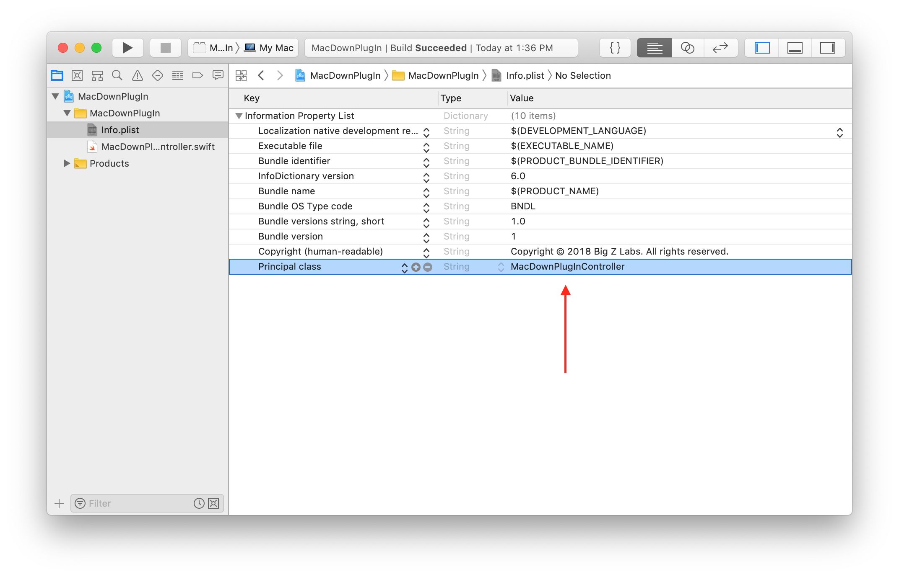
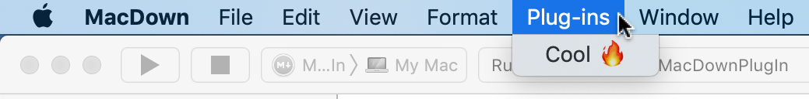

Creating a Swift MacDown Plug-In
================================

> 🔥 Looking for Objective-C? Check out [macdown-gistit](https://github.com/MacDownApp/macdown-gistit).

So you want to create your own Swift [MacDown](https://macdown.uranusjr.com) plug-in? Let's jump right in.

1. Create a new Xcode Project using the _Bundle_ macOS template.

   <p align="center">
       
   </p>
   
2. Go ahead and fill out the project options to your liking.

   > 📌 **Note:** Make sure the _Bundle Extension_ is set to `plugin`.

   <p align="center">
       
   </p>
   
3. Next step is to modify the build settings, so go ahead and find your way there. The only things we're interested in are: 
	* Setting the `ALWAYS_EMBED_SWIFT_STANDARD_LIBRARIES` to `Yes`.
	* Setting the `INSTALL_PATH` to `$(USER_LIBRARY_DIR)/Application Support/MacDown/PlugIns/`, which is where the MacDown plug-ins are located.
   <br/>
   
   > 🤔 **Why:** The `ALWAYS_EMBED_SWIFT_STANDARD_LIBRARIES` property ensures the required Swift standard libraries are embedded in our Swift plug-in, and we'll use the `INSTALL_PATH` in a post-action build script.
   
   <p align="center">
       
   </p>

4. Now we'll modify our main scheme. Hold <kbd>⌥ option</kbd> + click on the scheme, select the _Run_ action, and set the executable to your local `MacDown.app` (in the _Executable_ pop-up button's menu, select _Other..._ and navigate to and select the app).

   > 🔥 This will allow us to debug the plug-in using Xcode's Debugger.

   <p align="center">
       
   </p>
	
5. Now reveal the _Build_ action's sub-menu, select _Post-actions_, click the _+_ in the lower left corner of the right panel, and add a _New Run Script Action_. Provide the build settings from the plug-in's target, and paste the following script:

   > 🤔 **Why:** This step will copy our built plug-in to the MacDown's plug-in directory.

   > 📣 **Important:** Make sure you set the `INSTALL_PATH` build setting in step 3.

   ```
   # Allows us to see any script errors by running 'cat /tmp/xcode_build.log'.
   exec > /tmp/xcode_build.log 2>&1

   # Change the directory to the project root. Necessary because some of the build setting paths are relative.
   cd "$SRCROOT"
   # Create the plug-in directory, if it doesn't exist.
   mkdir -p "$INSTALL_PATH"
   # Copy the plug-in to MacDown's plug-in directory.
   cp -rf "$BUILT_PRODUCTS_DIR/$FULL_PRODUCT_NAME" "$INSTALL_PATH"
   ```

   <p align="center">
       
   </p>

6. Create a new Swift file, we'll name it _MacDownPlugInController.swift_.

   > 📌 **Note:** Upon creating the file, you should be prompted with the option to create an Objective-C Bridging Header. It's not necessary for the plug-in, so unless you plan on using it, you can select _no_.
   
   This file/class will be the entry point to your plug-in, so must have the [prescribed interface](https://github.com/MacDownApp/macdown-gistit/blob/master/README.md#plug-in-architecture).
   
   ```
   import AppKit
	
	// Subclassing a `NSObject` inherently exposes the class to the objective-c runtime, but it's better to be explicit.
	@objc(MacDownPlugInController)
	public class MacDownPlugInController: NSObject {
	
	    /// The display name of the plug-in.
	    ///
	    /// MacDown will use the value returned by this method as the menu item’s title for your plug-in.
	    @objc
	    public var name: String {
	        return "Cool 🔥"
	    }
	
	    /// This method will be invoked when your plug-in is run.
	    ///
	    /// This method may be invoked in the UI thread. Therefore, it is strongly recommended you push long operations into background threads, and/or run them asynchronously.
	    ///
	    /// - Parameter sender: The UI item that triggers the invocation—usually the `NSMenuItem` object the user clicked on, but could also be nil if the plug-in is triggered programmatically.
	    /// - Returns: Whether the plug-in invocation succeeded.
	    @objc(run:)
	    public func run(sender: Any) -> Bool {
	        guard let currentDocument = NSDocumentController.shared.currentDocument
	            else { return false }
	
	        let mpDocument = MPDocumentWrapper(mpDocument: currentDocument)
	        mpDocument.updateEditorMarkdown(to: "Hello. 👋\n" + mpDocument.markdown)
	        return true
	    }
	
	}
   ```
   
   But what is this `MPDocumentWrapper` nonsense? Great question. It's a Swift wrapper around MacDown's [`MPDocument`](https://github.com/MacDownApp/macdown/blob/master/MacDown/Code/Document/MPDocument.m) class that provides us with some incomplete interoperability. You can find the `MPDocumentWrapper` source file [here](https://github.com/chriszielinski/MacDown-Swift-Plug-In/blob/master/MacDownPlugIn/Models/MPDocumentWrapper.swift).
   
7. The **final** and most **important** step is to set the plug-in's _principal class_. Select the _info.plist_ file, and set the _Principal class_ field to the name of the class we created in the previous step.

   <p align="center">
       
   </p>
   
   Hit that beautiful play (run) button or <kbd>⌘ command</kbd> + <kbd>R</kbd>, and you should be good to go.
   
   <p align="center">
       
   </p>